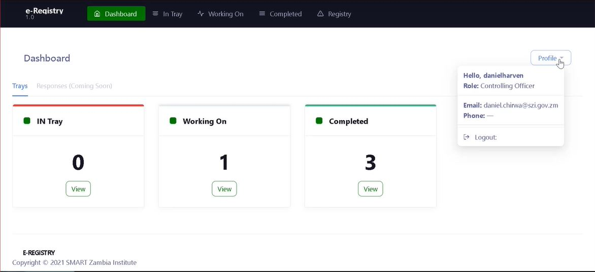

# Dashboard Menu

After a successful login the user is redirected to their dashboard. The dashboard contains the IN Tray, Working On tray and completed tray as well as the Registry. The user can click on the items to navigate to them.&#x20;

The user can also view their information by clicking on 'Profile'. A dropdown menu showing the user's information is displayed that also allows the user to log out of the system by clicking 'Logout'

The Officer dashboard presents users with trays represented as cards akin to trays seen in the real world. The trays are aligned in the order of which the letters are being process.


[in-tray](in-tray/)


